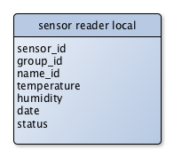

Sensor Reader
=============

> The Temperature Sensor Reader processes the temperature and humidity receiving from the [ELV USB-WDE1](http://www.elv.de/-353.html) sensor adapter.


Table of Content
----------------

* [Installation](#user-content-installation)
* [Start](#user-content-start)
* [Arguments](#user-content-arguments)
* [Settings](#user-content-settings)
* [Database Schema](#user-content-database-schema)
* [History](#user-content-history)
* [Statement](#user-content-statement)
* [License](#user-content-license)


Installation
------------

```sh
$ cd /path/to/install
$ git clone http://github.com/blueskyfish/temperature-sensor-reader.git
$ cd temperature-sensor-reader
$ npm install
$ npm link
```

**Inportent**
*Don\'t forget to create the `.tsr-settings.json` file in your home path.*


Start
-----

When call the command `npm link` before, there are created two short link in order to start the application.

**First**

```sh
$ tsreader
```

**Second**

```sh
$ tsreaderd
```

The Debug mode is on and the log messages are shown on the console.

**Third**

Call the full command

```sh
$ node reader.js [-d] [--config=/path/to/the/trs-settings.json]
```


Arguments
---------

The program arguments are optional.

| name               | description                                                                                   |
|--------------------|-----------------------------------------------------------------------------------------------|
| config             | the filename of the configuration. If not present, then it use `USER.HOME/.tsr-settings.json` |
| -d                 | application is in debug modus. All log message will be shown in the console.                  |


Settings
--------

The configuration for all parameters is in a js file. If the parameter `config` is not present, then it is looking for the file in the current folder.

property           | description
-------------------|-----------------------------
level.namespaces   | a key / value map (key = namespace, value = log level)
level.separator    | the separator in the namespace.
sensor.groupId     | the sensor group id
database.name      | the database name
database.host      | the host of the database server
database.port      | the port of the database server
database.user      | the user of the database
database.pass      | the password of the database user
server.url         | the url of the rest server (http://domain/path/server/upload)
port.name          | the filename of the serial port
port.baudrate      | the baudrate for reading the sensor raw data
port.separator     | the line separator

**Example**
```json
{
  "message": "this is an example settings for the temperature sensor reader",
  "logger": {
    "namespaces": {
      "root": "debug",
      "sensor": "config",
      "sensor.provider": "info",
      "sensor.provider.filter": "debug",
      "sensor.provider.database": "info",
      "sensor.provider.prepare": "debug",
      "sensor.provider.sensor": "debug"
    },
    "separator": "."
  },

  "sensor": {
    "groupId": 1000
  },

  "port": {
    "name": "/dev/ttyXX",
    "baudrate": 9600,
    "separator": "\r\n"
  },

  "schedule": {
    "value": 20,
    "unit": "minute"
  },

  "cache": {
    "timeoutPeriod": 170000
  },

  "database": {
    "name": "database",
    "host": "localhost",
    "port": 3306,
    "user": "dbuser",
    "pass": "dbpassword"
  },

  "server": {
    "url": "http://domain.tld/path/to/temo/server/upload"
  }
}
```


Database Schema
---------------

The sensor reader stores the data into a local mysql database. This database contains only one table.




History
-------

| Version     | Date       | Description
|-------------|------------|----------------------------
| v0.5.0      | 2015-11-21 | complete transfer from the old project *temperature-monitor*.


Statement
---------

This application needs the [ELV USB-WDE1 Adapter](http://www.elv.de/-353.html). This is a private hobby project and I have no business relationship with the company [ELV GmbH](http://www.elv.de).


License
-------

```
The MIT License (MIT)

Copyright (c) 2015 BlueSkyFish

Permission is hereby granted, free of charge, to any person obtaining a copy
of this software and associated documentation files (the "Software"), to deal
in the Software without restriction, including without limitation the rights
to use, copy, modify, merge, publish, distribute, sublicense, and/or sell
copies of the Software, and to permit persons to whom the Software is
furnished to do so, subject to the following conditions:

The above copyright notice and this permission notice shall be included in
all copies or substantial portions of the Software.

THE SOFTWARE IS PROVIDED "AS IS", WITHOUT WARRANTY OF ANY KIND, EXPRESS OR
IMPLIED, INCLUDING BUT NOT LIMITED TO THE WARRANTIES OF MERCHANTABILITY,
FITNESS FOR A PARTICULAR PURPOSE AND NONINFRINGEMENT. IN NO EVENT SHALL THE
AUTHORS OR COPYRIGHT HOLDERS BE LIABLE FOR ANY CLAIM, DAMAGES OR OTHER
LIABILITY, WHETHER IN AN ACTION OF CONTRACT, TORT OR OTHERWISE, ARISING FROM,
OUT OF OR IN CONNECTION WITH THE SOFTWARE OR THE USE OR OTHER DEALINGS IN
THE SOFTWARE.
```